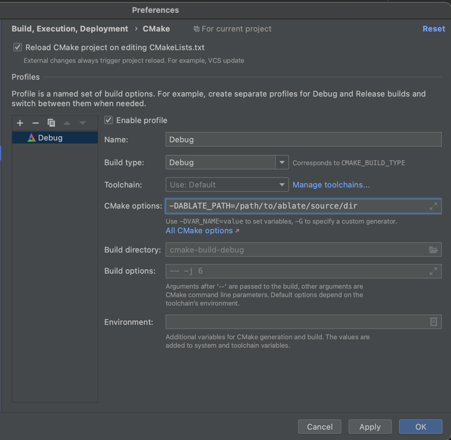

# ABLATE Client Template

An example ABLATE client that illustrates using ABLATE in your application. See
the [ABLATE documentation](https://ablate.dev/content/development/ClientLibrary.html) for details about the library.

You must install PETSc following the instructions for you system on
the [ABLATE Build Wiki](https://github.com/UBCHREST/ablate/wiki) along with setting additional PETSc environmental
variables:

```bash
export PETSC_DIR="" #UPDATE to the real path of petsc
export PETSC_ARCH="arch-ablate-debug" # arch-ablate-debug or arch-ablate-opt
export PKG_CONFIG_PATH="${PETSC_DIR}/${PETSC_ARCH}/lib/pkgconfig:$PKG_CONFIG_PATH"
```

If developing features for ABLATE you may want to specify a local build of ABLATE instead of downloading it. This can be
done with the CMAKE option ABLATE_PATH. For example if configuring on the command line:

    ```bash
    cmake -DABLATE_PATH=/path/to/ablate/source/dir  -S ../ablateClientTemplate -B .
    ```

or if using CLion [specify the option](https://www.jetbrains.com/help/clion/cmake-profile.html) as shown.
